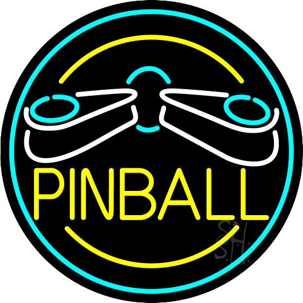

# PinBall Game
- Pin-Ball is a clone of classic pinbll game in HTML, CSS and JS,
- You can see the live demo [here](https://rededge.is-a.dev/Pin-Ball).

### Link : https://rededge.is-a.dev/Pin-Ball

## Running `Pinball`
### Running `Online`
- Open a browser window
- type https://rededge.is-a.dev/Pin-Ball in the searchbar
- hit `Enter`

### Running `offline`
- Download the latest release from the [releses](https://github.com/RedEdge967/Pin-Ball/releases).
- It will be a `.zip` file
- Extract it
- Run `index.html` file in your browser

### Gameplay

https://user-images.githubusercontent.com/91379432/167096525-0b3bd7a8-e1ea-4ced-ba5d-d051855cbb5e.mp4

## Can I contribute?
- Of course you can. open an issue, point out errors and what not? wanna fix something yourself. open a PR and I really appreciate it.

## Support
- You can support this project by **giving a star** to this project.
